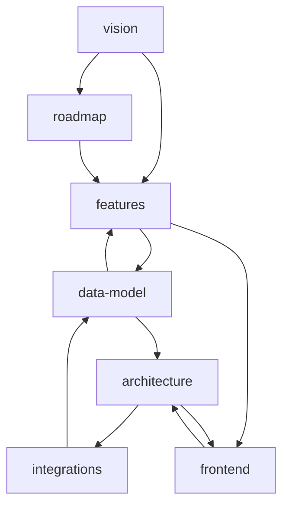

# Wax Wiki

> Source of truth for product, architecture, and direction.

## Graph

## Nodes

| Node | Description |
|---|---|
| [vision](./pages/vision.md) | What Wax is, why it exists, design philosophy |
| [features](./pages/features.md) | Shipped features and their scope |
| [roadmap](./pages/roadmap.md) | Planned features and future direction |
| [data-model](./pages/data-model.md) | Core domain entities and their relationships |
| [architecture](./pages/architecture.md) | System structure, modules, and key patterns |
| [integrations](./pages/integrations.md) | External services and how they connect |
| [frontend](./pages/frontend.md) | UX approach, rendering model, styling |
